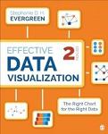
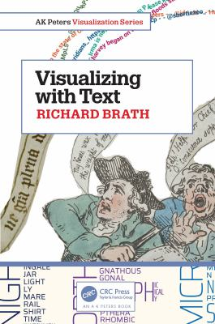
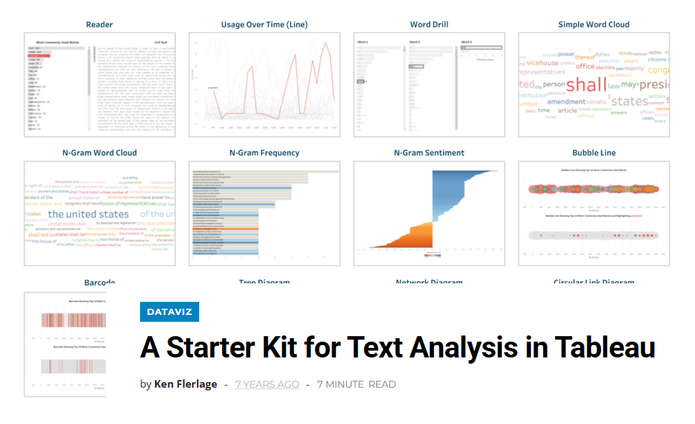

Qualitative data visualization represents non-numerical, descriptive data to help audiences understand patterns, themes, meanings, and relationships. This type of data often comes from descriptions, opinions, and personal experiences collected through interviews, observations, or open-ended survey questions.

Instead of focusing on numbers, qualitative data visualization helps explain what people say, think, or experience, and how those ideas connect to one another.

Some qualitative data visualizations focus directly on the text itself. “Pure” qualitative visualizations highlight the meanings of words using:

- Quotes
- Diagrams 
- Annotations
- Thematic groupings

Other qualitative data visualizations are created by first coding and then categorizing words. Once coded, the data is counted and visually displayed to show patterns, themes, and relationships.

# Books

  
EFFECTIVE DATA VISUALIZATION

  

  

  <ul class="list-group list-group-flush">
    <li class="list-group-item">
Chapter 8 of Stephanie Evergreen’s <a href="https://search.library.osu.edu/permalink/01OHIOLINK_OSU/1n8rc7n/alma991085549207608507">Effective Data Visualization: The Right Chart for the Right Data,</a> "When the Words Have the Meaning: Visualizing Qualitative Data," introduces several creative ways to visualize qualitative research. 
 
Evergreen encourages readers to look beyond basic bar charts, word clouds, and heat maps. Instead, she presents alternatives, including:
 <ul> <li>Images with call-out numbers or text boxes</li> <li>Journey maps that show experiences over time</li> <li>Network diagrams that reveal relationships</li> <li>Timelines and spectrum displays</li> </ul>
These techniques help communicate insights from qualitative research in ways that are clear, engaging, and meaningful.
 </li>
  </ul>

  
VISUALIZING WITH TEXT

  

  

  <ul class="list-group list-group-flush">
    <li class="list-group-item">In <a href="https://search.library.osu.edu/permalink/01OHIOLINK_OSU/l4v3dr/alma991085709546708507">Visualizing with Text</a>, Richard Brath reminds readers that text has been part of information visualizations since medieval times. The book includes 240 historical and contemporary examples showing how text can be used creatively and effectively to communicate information visually.</li>
  </ul>

# TEST

  
EFFECTIVE DATA VISUALIZATION

  

    

     
      

        

          Chapter 8 of Stephanie Evergreen’s 
          <a href="https://search.library.osu.edu/permalink/01OHIOLINK_OSU/1n8rc7n/alma991085549207608507">
            Effective Data Visualization: The Right Chart for the Right Data
          </a>.
        

        
Alternatives include:

        <ul>
          <li>Images with annotations</li>
          <li>Journey maps</li>
          <li>Network diagrams</li>
          <li>Timelines</li>
        </ul>
      

    

  

# Free Resources

## Tableau

Tableau is a useful tool for exploringe and visualizing qualitative data. Ken Flerlage’s [A Starter Kit for Text Analysis in Tableau](https://www.flerlagetwins.com/2019/09/text-analysis.html) shows you how to:

- Clean and organize text data for analysis
- Structure data so Tableau and read and visualize it effectively
- Create visualizations including tree diagrams, word clouds, network diagrams, and barcode charts
- Build an interactive text reader that allows users to highlight specific words within a body of text.

## NVivo
NVivo allows you to visually explore coded qualitative data using hierarchy charts, word clouds, concept maps, and more. The videos below provide step-by-step instructions for creating a variety of visualizations in NVivo.

### Visualization with NVivo
This one-hour webinar for the NVivo Research Network covers coding stripes, hierarchy charts, word clouds, concept maps and more.


### NVivo for 15 Mac: Visualizing Coding
This video demonstrates how to visually explore your coded data using intuitive tools like hierarchy charts, which display the relative weight of each code based on how frequently it appears across your sources. The video shows how these visualizations make it easy to identity dominant themes at a glance, helping you prioritize areas for deeper analysis.


### 9 Ways to Visualize Your Results in NVivo
This video walks through nine powerful ways to visualize qualitative data analysis results directly in NVivo, from generating word frequency clouds and charts to using cluster analysis to uncover patterns across your codes. 


### NVivo: How to Create a Bar Chart


