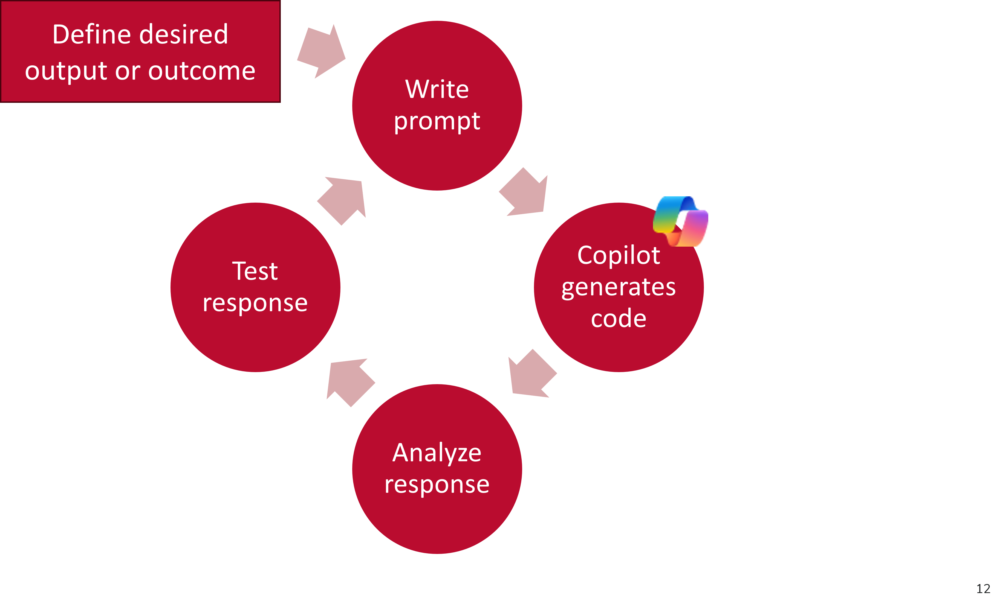
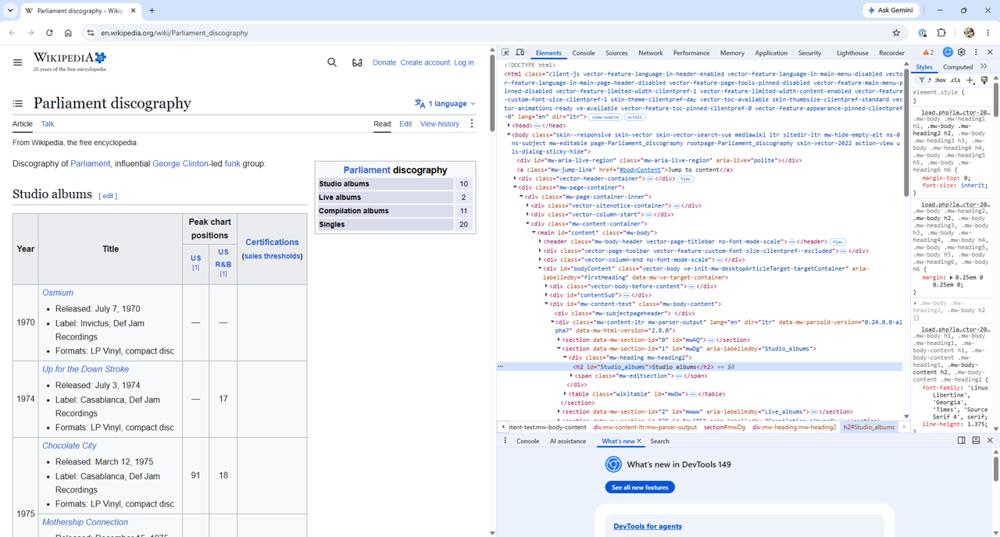
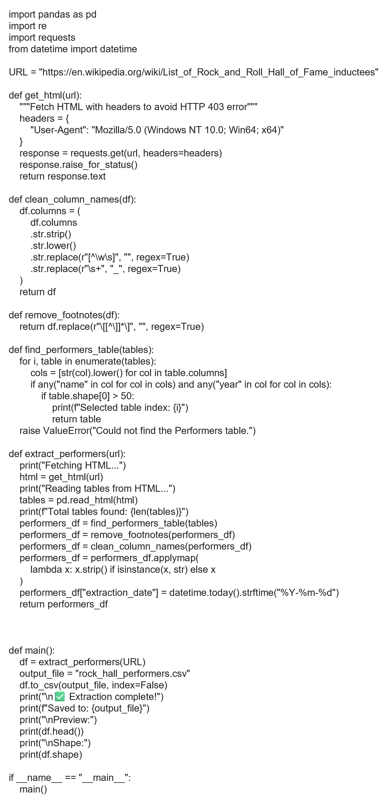

---
format:
  revealjs:
    theme: white
    css: 
      - slides.css
      - ../styles/custom.scss
      - https://cdn.jsdelivr.net/npm/bootswatch@5/dist/simplex/bootstrap.min.css

    include-in-header:
      - ../styles/osu-fonts.html
    logo: slide_images/osu_libraries.png
    slide-number: true
    chalkboard: true
    multiplex: true
---

## Python Mastering the Basics 
Part 2: AI-Assisted Programming

{width="100%"}

--- 

## Getting Started

1. Create an empty file named **python_workshop** on your desktop
2. Go to [https://go.osu.edu/python_mastering_basics](https://go.osu.edu/python_mastering_basics)
3. Download and place in your **python_workshop** folder:

      - carmen_ohio.txt
      - carmen_ohio_revised.txt
      - python_mastering_basics_workshop_exercises.py

4. Open [Python Pocket Reference](https://static.realpython.com/python-cheatsheet.pdf)
5. Open [Pandas Cheet Sheet](https://pandas.pydata.org/Pandas_Cheat_Sheet.pdf)

--- 

## Learning Objectives{.smaller}

**Python Fundamentals**

- Construct variables, manipulate strings, and loop through lists
- Build and navigate dictionaries
- Define and use functions
- Export data to CSV files

**AI-Assisted Programming**

- Develop effective plain-language AI-prompts to generate, explain, and refine Python code.
- Analyze, test and refine AI-generated Python code.

---

## AI can ...

- Explain code in plain language 
- Help set up your environment and tools
- Simplify technical documentation
- Generate and improve code documentation
- Support debugging and troubleshooting
- Identify, explain and help fix errors
- Recommend solutions and alternative approaches
- Enable rapid prototyping of ideas
- Facilitate learning through guided experimentation

---

## Mastering the basics can help you ...

- Write clearer, more precise AI prompts
- Assess whether AI-generated code is correct and efficient
- Test, validate, and debug your assumptions
- Recognize bias in data, logic, and outputs
- Read, customize, and confidently reuse and apply shared code

---

## Quick review

- Absolute vs. relative paths
- Reading and writing files
- Working with strings
- Conditionals and comparisons
- Lists and Loops
- Dictionaries
- Functions
- Export data to CSV file

---

## pandas

A pandas **DataFrame** is one of the most powerful and commonly used data strutures in Python for working with **tabular data**, or data that is organized in rows and columns, similar to a spreadsheet or SQL tables. Think of it like an Excel or Google sheet or a table in a database, with:

- **Rows** (each representing an observation or record)
- **Columns** (each representing a variable or feature)

```{.python}
import pandas as pd

df = pd.DataFrame([data, index, columns, dtype, copy])
```

---

<div class="table-responsive">
  <table class="table table-hover" style="font-size:0.5em;">
    <thead>
      <tr class="table-primary">
        <th></th>
        <th>"year"</th>
        <th>"title"</th>
        <th>"author"</th>
        <th>"number_challenges"</th>
        <th>"rank"</th>
      </tr>
    </thead>
    <tbody>
      <tr>
        <td>1</td>
        <td>2025</td>
        <td>"Sold"</td>
        <td>"Patricia McCormick</td>
        <td>36</td>
        <td>1</td>
      </tr>
      <tr>
        <td>2</td>
        <td>2025</td>
        <td>"The Perks of Being a Wallflower"</td>
        <td>"Stephen Chbosky"</td>
        <td>33</td>
        <td>2</td>
      </tr>
      <tr>
        <td>3</td>
        <td>2025</td>
        <td>"Gender Queer"</td>
        <td>Maia Kobabe"</td>
        <td>25</td>
        <td>3</td>
      </tr> 
      <tr>
        <td>4</td>
        <td>2025</td>
        <td>"Empire of Storms"</td>
        <td>"Sarah J. Maas"</td>
        <td>24</td>
        <td>4</td>
      </tr>
      <tr>
        <td>5</td>
        <td>2025</td>
        <td>"Last Night at the Telegraph Club"</td>
        <td>"MAlinda Lo"</td>
        <td>23</td>
        <td>5</td>
      </tr>
      <tr>
        <td>6</td>
        <td>2025</td>
        <td>"Tricks"</td>
        <td>"Ellen Hopkins"</td>
        <td>23</td>
        <td>5</td>
      </tr>
    </tbody>
  </table>
</div>


```{.python}
df = pd.DataFrame({
                  "year" : 2025,
                  "rank" : [1,2,3,4,5,5],
                  "title" : ["Sold","The Perks of Being a Wallflower","Gender Queer","Empire of Storms","Last Night at the Telegraph Club","Tricks"],
                  "author" : ["Patricia McCormick","Stephen Chbosky","Maia Kobabe","Sarah J. Maas","Malinda Lo","Ellen Hopkins"],
                  "number_challenges" : [36,33,25,24,23,23]
})
```

---

## PROJECT{.smaller}

::::{.columns}

:::{.column width="40%"}
When learning Python, it's incredibly helpful to work with **data that matters to you**. To explore creating effective plain-language AI prompts to generate, explain, and refine Python code we will extract the **Performers** table found on the [List of Rock and Roll Hall of Fame inductees](https://en.wikipedia.org/wiki/List_of_Rock_and_Roll_Hall_of_Fame_inductees) webpage in Wikipedia. We will then assemble discographies for 2-3 of our favorite artists and store these discographies in a separate folder for each artist.

:::

:::{.column width="60%"}


:::

::::

---

## Webscraping or API projects: Basic steps

1. Review and understand copyright and terms of use
2. Check to see if an API is available
3. Examine the URL
4. Inspect the elements
5. Identify Python libraries for project
6. Write and test code


---



---

## Effective plain-language AI prompts

- Strike a balance. Be specific without overwhelming detail.
- Ask for one step or solution at a time.
- Specify the format of the response (ie. Python script, explanation, documentation).
- Clearly define the desired output or outcome.

---

<div class="card border-primary mb-3 p-1">
  <div class="card-header" style="font-size: 2.4rem;">Tip: Let Copilot Help You Write Better Prompts</div>
  <div class="card-body">
  <p>Describe what you want to build in plain language. Then have Copilot ask follow-up questions to clarify your idea and identify any gaps. Once your goal is well defined, ask Copilot to create a system prompt that helps it select the best Python tools, libraries, and techniques for your project.</p>
  <p><strong>Example:</strong> "I want to build a [describe your project]. Ask me any questions you need to better understand my goal, then help me create a system prompt that will guide you in selecting the right Python tools and libraries."</p>
  </div>
</div>

---

## Copyright | Terms of Use

Before starting any web scraping or API project, you must

**Review and understand the terms of use**

- Do the terms of service include any restrictions or guidelines?
- Are permissions/licenses needed to scrape data?
- Is the information publicly available?
- If a database, is the database protected by copyright? Or in the public domain?

---

**Check for robots.txt directives**
**robots.txt** directives limit web scraping or web crawling. Look for this file in the root directory of the website by adding `/robots.txt` to the end of the url. Respect these directives.

---

<div class="alert alert-dismissible alert-primary">
  Exercise 1: Examine Copyright | Terms of Use
</div>

Locate and read the terms of use for the [List of Rock and Roll Hall of Fame inductees](https://en.wikipedia.org/wiki/List_of_Rock_and_Roll_Hall_of_Fame_inductees) found on Wikipedia. 

1. What are the copyright restrictions for this resource?
2. What are the terms of use?

---

<div class="alert alert-dismissible alert-primary">
  Solution:
</div>

Read Wikipedia [Creative Commons Attribution-ShareAlike 4.0 License](https://en.wikipedia.org/wiki/Wikipedia:Text_of_the_Creative_Commons_Attribution-ShareAlike_4.0_International_License)

---

<div class="alert alert-dismissible alert-primary">
  Exercise 2: API Available?
</div>

Is an API available?

---

<div class="alert alert-dismissible alert-primary">
  Solution:
</div>

Yes, but it may take some time to learn how to use. It is not necessary for today's project.

---

<div class="alert alert-dismissible alert-primary">
  Exercise 3: Examine the URL
</div>

Select 2-3 inductees from the Performers category and locate their album discography in Wikipedia. Examine the structure of the URL for each album discography page.

---

<div class="alert alert-dismissible alert-primary">
  Solution:
</div>

### Example: Parliament-Funkadelic
#### Parliament discography
[https://en.wikipedia.org/wiki/Parliament_discography](https://en.wikipedia.org/wiki/Parliament_discography)\
*https:// + en.wikipedia.org/ + wiki/ + Parliament_discography*

#### Funkadelic discography
[https://en.wikipedia.org/wiki/Funkadelic_discography](https://en.wikipedia.org/wiki/Funkadelic_discography)\
*https:// + en.wikipedia.org/ + wiki/ + Funkadelic_discography*

---

## Inspect the elements

Both **XML** and **HTML** are structured as trees, where elements are nested within one another. When you request a URL, the server returns an HTML or XML document. Your browser then downloads and parses this document to display it visually. Google Chrome's [Developer Tools](https://developer.chrome.com/docs/devtools/dom) **(F12)** allow us to explore and understand the structure of a webpage

---



---

<div class="alert alert-dismissible alert-primary">
  Exercise 4: Inspect the elements
</div>

Go to the discography page for each artist you selected. Are there differences in how the tables are structured and presented on each page? For example, do tables have a title or header? 

---

## Brain Break

:::: {.columns}

::: {.column width="40%"}
- Stand up
- Turn around
- Touch your nose
- Touch your toes
:::

::: {.column width="60%"}
{width="100%"}
:::

::::

---

## pandas

A pandas **DataFrame** is one of the most powerful and commonly used data strutures in Python for working with **tabular data**, or data that is organized in rows and columns, similar to a spreadsheet or SQL tables. Think of it like an Excel or Google sheet or a table in a database, with:

- **Rows** (each representing an observation or record)
- **Columns** (each representing a variable or feature)

```{.python}
import pandas as pd

df = pd.DataFrame([data, index, columns, dtype, copy])
```

---

## pd.read_html(){.smaller}

Use **pandas** to read HTML tables directly into DataFrames with `.read_html()`. This extremely useful tool extracts all tables present in a specified URL or file, allowing each table to be accessed using standard list indexing and slicing syntax.

The following code instructs Python to go to the Wikipedia [List of states and territories of the United States](https://en.wikipedia.org/wiki/List_of_states_and_territories_of_the_United_States) and retrieve the second table.

```{.python}
import requests
import pandas as pd
from io import String IO # Recommended to avoid FutureWarning.

url='https://en.wikipedia.org/wiki/List_of_states_and_territories_of_the_United_States'
headers = {'User-Agent':'Mozilla/5.0'}
response = requests.get(url, headers=headers).text
tables = pd.read_html(StringIO(response))
tables[1]

```

 ---

## requests

The **requests** library retrieves HTML or XML documents from a server and processes the response.

```{.python}
import requests
url = 'https://library.osu.edu' #INSERT URL HERE
respone = requests.get(url)
text = response.text #THIS RETURNS THE RESPONSE CODED AS TEXT
bytes = response.content #THIS RETURNS THE RESPONSE CONTENT AS BYTES
```

---

## Beautiful Soup

[BeautifulSoup](https://beautiful-soup-4.readthedocs.io/en/latest/) parses HTML and XML documents, helping you search for and extract elements from the DOM. The first argument is the content to be parsed, and the second specifies the parsing library to use.

- **html.parser** – The default HTML parser
- **lxml** – a faster parser with more features
- **xml** – parses XML
- **html5lib** – for HTML5 parsing

---

```{.python}
import requests
from bs4 import BeautifulSoup

url = 'https://library.osu.edu' #INSERT URL HERE
headers = {'User-Agent': 'Mozilla/5.0'}
response = requests.get(url, headers=headers)
response.encoding = "utf-8"
text = response.text
soup = BeautifulSoup(text, 'html.parser')
```

---

## Using BeautifulSoup

Various methods and approaches may be used to gather and extract HTML elements using BeautifulSoup. First we ask BeautifulSoup to [search the tree](https://beautiful-soup-4.readthedocs.io/en/latest/#find-all) to find the element nodes we identified in Exercise 4.

### .find_all()
Gathers all instances of a tag (i.e. element) and returns a response object. Each instance of the tag is then examined using a `for` loop.

```{.python}
find_all(name, attrs, recursive, string, limit, **kwargs)
```

---

## Example

```{.python}
import requests
from bs4 import BeautifulSoup

url="https://en.wikipedia.org/wiki/Parliament_discography"
headers = {'User-Agent': 'Mozilla/5.0'}
response = requests.get(url, headers=headers)
response.encoding = "utf-8"
text = response.text
soup = BeautifulSoup(text, 'html.parser')
table_titles = soup.find_all("h2")
for table_title in table_titles:
    title = table_title.string
    print(title)
```

**Note** that `soup.find_all("h2")` is equivalent to `soup.h2`. Appending `.string` to `table_title` extracts the text between the tags for `h2`.

---

<div class="card border-primary mb-3 p-1">
  <div class="card-header" style="font-size: 2.4rem;">Tip</div>
  <div class="card-body">
  <p>Learning to navigate tags with BeautifulSoup can be difficult at first. Try using Copilot in tandem with <a href="https://beautiful-soup-4.readthedocs.io/en/latest/">BeautifulSoup’s</a> documentation to help you both identify and understand how to apply useful methods for your project.</p>
  <p><strong>Example:</strong> Ask Copilot what is the difference between <code>tag.string</code> and <code>tag.text</code> in BeautifulSoup.</p>
  </div>
</div>

---

### .find()

Gathers the first instance of a tag.

```{.python}
find(name, attrs, recursive, string,**kwargs)
```
<br>

### .find_next() or find_all_next()
### .find_previous() or find_all_previous()

Gathers the following or previous instances of a named tag.

```{.python}
find_next(name, attrs, string,**kwargs)
find_all_next(name, attrs, string, limit, **kwargs)
```

---

### attributes

```{.python}
name[attr]
```

Tags can have any number of [attributes](https://beautiful-soup-4.readthedocs.io/en/latest/#attributes).

<br>

**Example:**

`href` is an attribute of a `<a href="url">` tag. To find a `href` attribute value:

```{.python}
a['href']
```

---


---

## Effective plain-language AI prompts

- Strike a balance. Be specific without overwhelming detail.
- Ask for one step or solution at a time.
- Specify the format of the response (ie. Python script, explanation, documentation).
- Clearly define the desired output or outcome.

---

## Problem decomposition

**TASK 1: Extract the Performers table found on the List of Rock and Roll Hall of Fame inductees**

1. Go to [List of Rock and Roll Hall of Fame inductees](https://en.wikipedia.org/wiki/List_of_Rock_and_Roll_Hall_of_Fame_inductees) Wikipedia page
2. Extract the **Performers** table

---

<div class="alert alert-dismissible alert-danger">
  <p>I want to extract the Performers table from the <a href="https://en.wikipedia.org/wiki/List_of_Rock_and_Roll_Hall_of_Fame_inductees">List of Rock and Roll Hall of Fame inductees</a> Wikipedia page. Ask me any questions you need to better understand my goal, then help me create a system prompt that will guide you in selecting the right Python tools and libraries.</p>
</div>

---



---

```{.python}
import requests
import pandas as pd
from io import StringIO

url='https://en.wikipedia.org/wiki/List_of_Rock_and_Roll_Hall_of_Fame_inductees'
headers = {'User-Agent':'Mozilla/5.0'}
response = requests.get(url, headers=headers).text
tables = pd.read_html(StringIO(response))
performers = tables[0]
```

---


---

## Effective plain-language AI prompts

- Strike a balance. Be specific without overwhelming detail.
- Ask for one step or solution at a time.
- Specify the format of the response (ie. Python script, explanation, documentation).
- Clearly define the desired output or outcome.

---

## Problem decomposition

**TASK 2: Assemble discographies for 2-3 of your favorite artists on the Performers List**

1. baseURL = "https://en.wikipedia.org/wiki"
2. artists = ['Cyndi_Lauper_discography','Joe_Cocker_discography',
'The_White_Stripes_discography']
3. Iterate through the selected artists Wikipedia discography pages, extract all tables, and assign each table a meaningful name based on the preceding HTML header.

---

<div class="alert alert-dismissible alert-danger">
  <p>I want to __________ using _______. Ask me any questions you need to better understand my goal, then help me create a system prompt.
</p>
</div>

---

## Brain Break

:::: {.columns}

::: {.column width="40%"}
- Stand up
- Turn around
- Touch your nose
- Touch your toes
:::

::: {.column width="60%"}
{width="100%"}
:::

::::

---


---

## Effective plain-language AI prompts

- Strike a balance. Be specific without overwhelming detail.
- Ask for one step or solution at a time.
- Specify the format of the response (ie. Python script, explanation, documentation).
- Clearly define the desired output or outcome.

---

## Problem decomposition

**TASK 3: Store discography tables for each artist in your project folder**

1. Make a directory for each artist in my project folder
2. Save each table as a .csv
3. Handle duplicate table names safely(_1,_2, etc…)

---

## Managing files{.smaller}

There are several best practices and considerations for effectively managing research data files. When extracting and locally storing data in individual files, using standardized file naming conventions not only helps you organize and utilize your files efficiently but also facilitates sharing and collaboration with others in future projects.

- Use short, descriptive names
- Use `_` underscores or `–` dashes instead of spaces in your file names. Use leading zeros for sequential numbers to ensure proper sorting.
- Use all lowercase for directory and filenames if possible.
- Avoid using special characters, including `~!@#$%^&*()[]{}?:;<>|\/`
- Use standardized dates **YYYYMMDD** to track versions and updates.
- Include version control numbers to keep track of projects.

---

## os module

The `os` module tells Python where to find and save files.

<br>

**os.mkdir('path')**\
Makes a directory in your project folder or another folder your specify. If a directory by the same name already exists in the path specified, `os.mkdir` will raise an `OSError`. Use a try-except block to handle the error.

---

```{.python}
import os
artist = "Cyndi_Lauper"

try:
	os.mkdir(artist)
except:
	print(f"Directory for {artist} already exists")
except:
	print(f"An error occurred: {e}")

```

---

<div class="alert alert-dismissible alert-danger">
  <p>I want to __________ using _______. Ask me any questions you need to better understand my goal, then help me create a system prompt.
</p>
</div>

