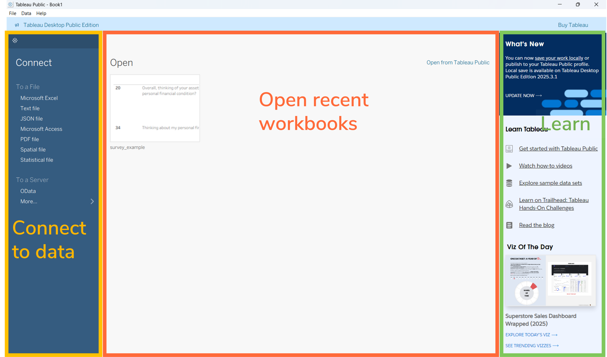
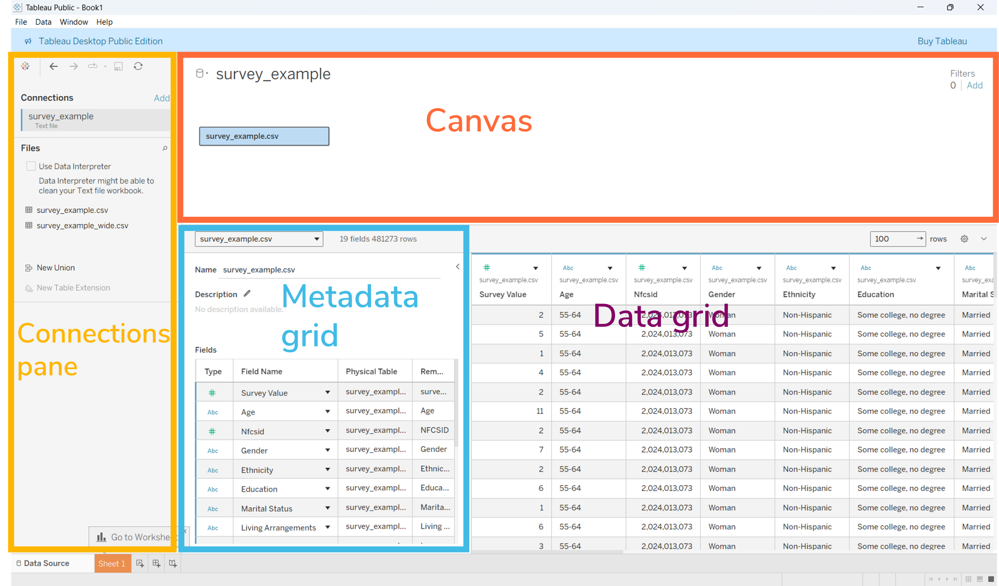
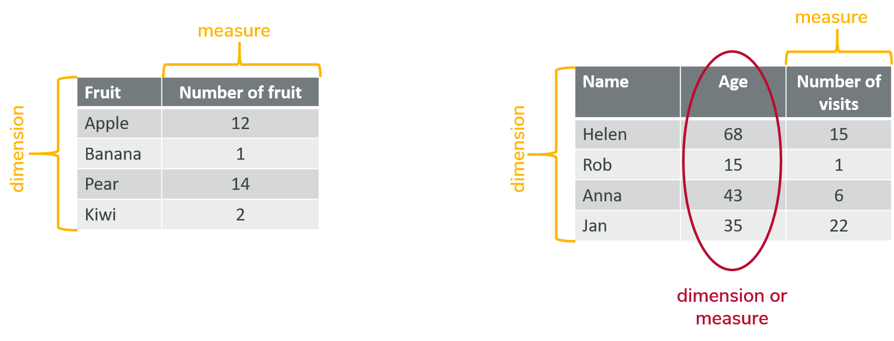
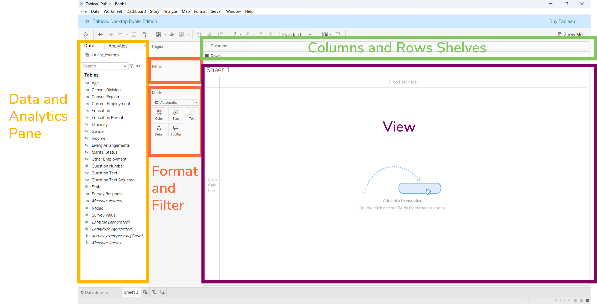
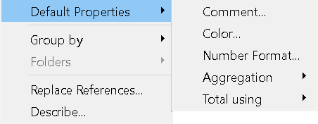
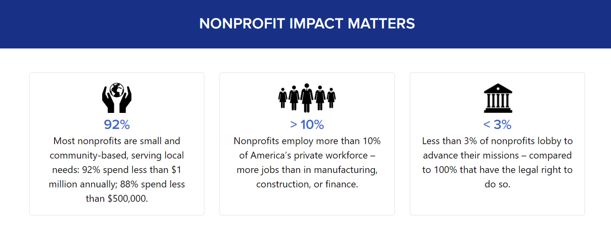

---
format:
  revealjs:
    theme: white
    css: 
      - slides.css
      - ../styles/custom.scss
      - https://cdn.jsdelivr.net/npm/bootswatch@5/dist/simplex/bootstrap.min.css

    include-in-header:
      - ../styles/osu-fonts.html
    logo: slide_images/osu_libraries.png
    slide-number: true
    chalkboard: true
    multiplex: true

---

---

## Welcome to Tableau for Research

{width="100%" fig-alt="A computer with a screen showing a survey"}

---

## Getting Started

1. Create an empty file named **tableau_research** on your desktop.
2. Go to [https://go.osu.edu/tableau_research](https://go.osu.edu/tableau_research)
3. Download and place in **tableau_research** folder:
    - rock_n_roll_performers.csv
    - rock_n_roll_studio_albums.csv

---

## DRAMA Framework

<strong>D</strong>ate

<small>Is the data current and up to date? Does it reflect current trends?</small>

<strong>R</strong>elevance

<small>Is the dataset appropriate for your research question, population, and intended use?</small>

<strong>A</strong>ccuracy

<small>Is the data reliable, valid and consistently collected?</small>

<strong>M</strong>otivation

<small>Why was the data collected, and are there any potential biases or important omissions?</small>

<strong>A</strong>uthority

<small>Who collected the data and are they credible?</small>

---

{width="100%" fig-alt="Screenshot of Tableau Desktop Public Edition interface showing data connection options and recent workbooks. Left panel lists file types like Microsoft Excel and JSON for data connection, center displays Open recent workbooks message, and right panel features What's New updates and learning resources."}

---

{width="100%" fig-alt="Screenshot of Tableau Desktop Public Edition interface showing the data source workspace. The layout includes a Connections pane on the left listing data sources, a Metadata grid in the center displaying field names and types, and a Data grid on the right with survey data rows"} 

---

## Wide Data

{width="100%" fig-alt="Two tables compare dimensions and measures a wide data structure. The left table lists fruits with corresponding quantities in each row, while the right table shows names, ages, and visit counts, highlighting age as either a dimension or measure with a red oval."}

---

## Tall Data

<table class="table">
    <thead>
        <tr>
            <th>Name</th>
            <th>Dimension</th>
            <th>Measure</th>
        </tr>
    </thead>
    <tbody>
        <tr>
            <td>Helen</td>
            <td>Age</td>
            <td>68</td>
        </tr>
        <tr>
            <td>Helen</td>
            <td>Visits</td>
            <td>15</td>
        </tr>
        <tr>
            <td>Rob</td>
            <td>Age</td>
            <td>15</td>
        </tr>
        <tr>
            <td>Rob</td>
            <td>Visits</td>
            <td>1</td>
        </tr>
        <tr>
            <td>Anna</td>
            <td>Age</td>
            <td>43</td>
        </tr>
        <tr>
            <td>Anna</td>
            <td>Visits</td>
            <td>6</td>
        </tr>
    </tbody>
</table>

---

Exercise 1: Transform data to a tall format

<small>

Try transforming the <code>rock_n_roll_performers.csv</code> dataset from <strong>wide</strong> to <strong>tall</strong> format using Tableau's pivot feature.

<table class="table">
<tbody>
    <tr>
        <td>1.</td>
        <td>In the <strong>data grid</strong>, click to highlight the <strong>Year</strong> column.</td>
    </tr>
    <tr>
        <td>2.</td>
        <td>Hold the <strong>Shift</strong> key, scroll to the right, and click to highlight the <strong>Artist Url</strong> column.</td>
    </tr>
    <tr>
        <td>3.</td>
        <td>Click the ▼ caret on right side of the <strong>Artist Url</strong> column and select <strong>Pivot</strong>.</td>
    </tr>
    <tr>
        <td>4.</td>
        <td>To undo the pivot, press <strong>Ctrl+Z</strong> (Windows) or <strong>Cmd+Z</strong> (Mac).</td>
    </tr>
</tbody>
</table>
</small>

---

  Exercise 2: Relate Datasets

<small>
Let's enhance the <code>rock_n_roll_performers.csv</code> dataset by relating it to <code>rock_n_roll_studio_albums.csv</code> using the <strong>Artist</strong> field as a common key.

<table class="table">
  <tbody>
    <tr>
    <td>1.</td><td>In the <strong>Connections</strong> pane locate:</td>
    <td><code>rock_n_roll_studio_albums.csv</code></td>
    </tr>
    <tr>
    <td>2.</td><td>Drag and drop the table onto the canvas.</td>
    <td></td>
    </tr>
    <tr>
    <td>3.</td><td>In the <strong>relationship settings</strong>, set the relationship as:</td>
    <td><code>Artist</code> = <code>Artist1</code></td>
    </tr>
    </tbody>
</table>
</small>

---

{width="100%" fig-alt="Screenshot of Tableau Desktop interface showing a blank worksheet setup for data visualization. Key components include Data and Analytics pane on left for selecting fields, Format and Filter options below it, at top for arranging data, and a central View area prompting to add data to create visuals."}

---

  
<strong>Multiple ways to accomplish a task!!!</strong>

  

<small>The more you use Tableau, the more you'll notice there’s often more than one way to accomplish the same task!!!</small>

  

---

  Exercise 3: Change measure to dimension

Drag the **Index** field above the gray line to categorize **Index** as a dimension.

---

  
  <strong>Important! Null Values and Misclassified Data Types</strong>
  
<small>Be especially careful with null values and checking data types. Nulls can skew calculations like averages or medians. Misclassified data types, such as dates stored as integers, can lead to errors in analysis.</small>

  
<small>**Always verify that each column has the correct and consistent data types before building your visualizations.**</small>

---

{width="100%" fig-alt="A detailed infographic chart titled Visual Vocabulary categorizes various data visualization types into ten groups: Deviation, Correlation, Ranking, Distribution, Change over Time, Magnitude, Part-to-whole, Spatial, and Flow. Each category includes labeled examples with small colored thumbnails and brief descriptions, highlighting key visual elements and use cases, with a clean layout using distinct background colors for each section to aid differentiation."}

[https://ft-interactive.github.io/visual-vocabulary/](https://ft-interactive.github.io/visual-vocabulary/)

---

  
Tip: Worksheet Names

  

<small>Always give your worksheets clear, meaningful names. This makes it much easier to organize and navigate your dashboards or stories later on.</small>

  

---

  Exercise 4: Bar Chart

<small>
<table class="table">
  <tbody>
    <tr>
      <td>1.</td>
      <td>Open a new worksheet</td>
      <td>Click the <strong>worksheet icon</strong> next to your Barchart1 tab in the lower-left corner of the Tableau workspace.</td>
    </tr>
    <tr>
      <td>2.</td>
      <td>Rename the sheet</td>
      <td>Right-click on <strong>Sheet2</strong> and rename it <strong>BarChart2</strong>.</td>
    </tr>
    <tr>
      <td>3.</td>
      <td>Build your bar chart</td>
      <td>Use the <strong>album_title</strong> dimension and the <strong>Peak US</strong> measure to create a bar chart showing chart positions for each album.</td>
    </tr>
    <tr>
      <td>4.</td>
      <td>Experiment with layout</td>
      <td>Click the <strong>Swap</strong> button in the toolbar (horizontal ↔︎ vertical orientation).</td>
    </tr>
    <tr>
      <td>5.</td>
      <td>Sort the bars</td>
      <td>Use the <strong>Sort ascending</strong> button in the toolbar to arrange bars from lowest to highest chart position. </td>
    </tr>
  </tbody>
</table>
</small>

---

  Exercise 5: Bar Chart

<small>
<table>
<tbody>
    <tr>
        <td>1.</td>
        <td>Open a new worksheet and rename it:</td>
        <td><ul><li><strong>BarChart3</strong></li></ul></td>
    </tr>
    <tr>
        <td>2.</td>
        <td>Build the initial view.</td>
        <td><ul><li>Drag <strong>Release date</strong> to the Columns shelf.</li><li>Drag <strong>rock_n_roll_studio_albums.csv (Count)</strong> to the <strong>Rows</strong> shelf. <strong>Note:</strong> Tableau automatically creates a <strong>line chart</strong>, because <strong>Release date</strong> is recognized as a <strong>date field</strong>. </li></ul></td>
    </tr>
    <tr>
        <td>3.</td>
        <td>Change the chart type.</td>
        <td><ul><li>On the <strong>Marks Card</strong>, click the dropdown next to <strong>Automatic</strong> and select <strong>Bar</strong>.</li></ul></td>
    </tr>
</tbody>
</table>
</small>

---

  Exercise 6: Scatterplots

<small>

Create a scatterplot to compare the <strong>Peak US</strong> and <strong>Peak UK</strong> chart positions for albums released by your favorite artist inducted into the <a href="https://en.wikipedia.org/wiki/List_of_Rock_and_Roll_Hall_of_Fame_inductees">Rock and Roll Hall of Fame.</a>

<table>
<tbody>
    <tr>
        <td>1.</td>
        <td>Open a new worksheet and rename it:</td>
        <td><ul><li><strong>Scatterplot1</strong></li></ul></td>
    </tr>
    <tr>
        <td>2.</td>
        <td>Build the scatterplot:</td>
        <td><ul><li>Drag <strong>Peak US</strong> to the Columns shelf.</li><li>Drag <strong>Peak UK</strong> to the Rows shelf.</li></ul></td>
    </tr>
    <tr>
        <td>3.</td>
        <td>Filter by artist:</td>
        <td><ul><li>Drag <strong>Artist</strong> to the <strong>Filters</strong> shelf and select your favorite artist.</li></ul></td>
    </tr>
    <tr>
        <td>4.</td>
        <td>Add detail:</td>
        <td><ul><li>Drag <strong>album_title</strong> to <strong>Detail</strong> on the <strong>Marks card</strong>.</li></ul></td>
    </tr>

</tbody>
</table>
</small>

---

  
Tip: Outliers

  

<small>Outliers can significantly distort the results of a scatterplot, so it's important to handle them thoughtfully. Tableau makes it easy to exclude outlier data points: simply click on a mark to open the tooptip and select 🛇 Exclude, or right-click the mark and choose X Exclude.

However, always be sure to <strong>document your approach</strong> for handling outliers. Transparency in your data-cleaning decisions is essential for maintaining the integrity and reproducibility of your analysis.
</small>
  

---

  
Tip - Set Default Properties

  
<small>
To save time and ensure consistency, try setting <strong>Default Properties</strong> for dimensions and measures before starting a Tableau project.
<ol><li><strong>Right-click</strong> on each measure that begins with <strong>"Peak"</strong>.</li><li>Scroll to <strong>Default Properties</strong>, and select <strong>Number Format</strong>.</li><li>Choose <strong>Number Standard</strong> from the formatting options.</li>
This ensures that all selected measures display in a consistent numeric format throughout your workbook, reducing the need for repetitive formatting later on.
</ol></small>
  

---

{width="100%" fig-alt="Infographic titled Nonprofit Impact Matters presents key statistics about nonprofits. It highlights that 92% of nonprofits are small, community-based, with 88% spending less than $500,000; over 10% employ more than 10% of private workforce in specific industries; and less than 3% lobby to advance missions despite legal rights."}

---

## Practice Matters

### Inspiration and examples
- [Tableau Public Viz of the Day](https://public.tableau.com/app/discover/viz-of-the-day)
- [Flowing Data](https://flowingdata.com/category/visualization/)

### Explore data journalism
- [CNN](https://www.cnn.com/)
- [The New York Times](https://www.nytimes.com/)
- [The Washington Post](https://www.washingtonpost.com/)

---

  Exercise 7: Group data

<small>

Create a text table showing the <strong>peak US chart positions</strong> for albums by five of your favorite artists.

<table>
<tbody>
    <tr>
        <td>1.</td>
        <td>Start a new worksheet and rename it:</td>
        <td><ul><li><strong>FavoriteArtistAlbum</strong>.</li></ul></td>
    </tr>
    <tr>
        <td>2.</td>
        <td>Select the relevant fields</td>
        <td><ul><li>Drag <strong>Artist</strong> to the <strong>Rows shelf</strong>.</li><li>Place <strong>Peak US</strong> on the <strong>Columns shelf</strong>.</li></ul></td>
    </tr>
    <tr>
        <td>3.</td>
        <td>Open Show Me and select Text Tables</td>
        <td></td>
    </tr>
    <tr>
        <td>4.</td>
        <td>Select your top 5 favorite artists.</td>
        <td><ul><li>Click on your first favorite artist.</li><li>Hold <strong> Ctrl + Click</strong> to select the others.</li></ul></td>
    </tr>
    <tr>
        <td>5.</td>
        <td>Click the paperclip icon 📎 on the tooltip for the last artist selected.</td>
        <td></td>
    </tr>
</tbody>
</table>
</small>

---

<small>
<table>
<tbody>
    <tr>
        <td>6.</td>
        <td>Edit group alias.</td>
        <td><ul><li>Right-click the first artist.</li><li>Select <strong> Edit Alias</strong>.</li><li>Rename to <strong>Favorite artists.</strong></li></ul></td>
    </tr>
    <tr>
        <td>7.</td>
        <td>Right-click Favorite artists and choose:</td>
        <td><ul><li>✔ Keep only.</li></ul></td>
    </tr>
    <tr>
        <td>8.</td>
        <td>Adjust fields.</td>
        <td><ul><li>Drag <strong>Artist</strong> to the <strong>Rows shelf</strong>.</li><li>Drag <strong>album_title</strong> to the <strong>Rows shelf</strong>.</li><li>Remove <strong>Favorite artists</strong> from the <strong>Rows shelf</strong>.</li></ul></td>
    </tr>
    <tr>
        <td>9.</td>
        <td>Rename group.</td>
        <td><ul><li>Right-click <strong>Artist (group) 1 </strong> in the <strong>Data Pane</strong>.</li><li>Select <strong>Rename</strong> and type <strong>Favorite artists</strong>.</li></ul></td>
    </tr>
</tbody>
</table>
</small>

---

  Exercise 8: Group data

<small>

On the <strong>FavoriteArtistAlbum</strong> sheet, use the <strong>Data Pane</strong> to group 10 of your <strong>Favorite albums</strong> into a single group.

<table class="table">
<tbody>
    <tr>
        <td>1.</td>
        <td>Right-click <strong>album_title</strong> and select:</td>
        <td><ul><li><strong>Create > Group</strong>.</li></ul></td>
    </tr>
    <tr>
        <td>2.</td>
        <td>Rename the group:</td>
        <td><ul><li><strong>Favorite albums</strong>.</li></ul></td>
    </tr>
    <tr>
        <td>3.</td>
        <td>Find and add albums to the group.</td>
        <td>
            <ul>
                <li>Click <strong>Find >></strong> to search for the first album title.</li>
                <li>Under <strong>Find members</strong>, type the name of your first favorite album title and click <strong>Find All</strong>.</li>
                <li>When the album appears in the list, select it and click <strong>Group</strong>.</li>
                <li>Alias the group <strong>Favorite albums</strong>.</li>
            </ul></td>
    </tr>
</tbody>
</table>
</small>

---

<small>
<table class="table">
<tbody>
    <tr>
        <td>4.</td>
        <td>Repeat the process for each additional album.</td>
        <td>
            <ul>
                <li>Type the album name under <strong>Find members</strong>, then click <strong>Find All</strong>.</li>
                <li>Select the album.</li>
                <li>Use the <strong>Add to:</strong> dropdown to add each adidtional album to <strong>Favorite albums</strong>.</li>
            </ul>
        </td>
    </tr>
    <tr>
        <td>5.</td>
        <td>✔ Include 'Other' to consolidate non-favorite titles.</td>
        <td></td>
    </tr>
</tbody>
</table>
</small>

