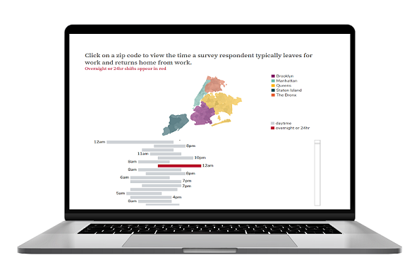
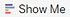
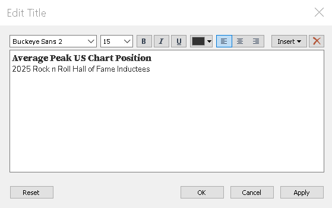
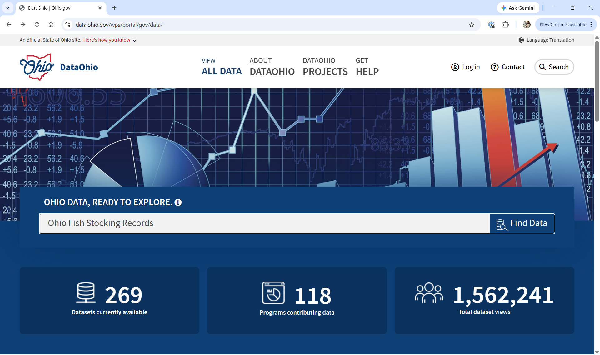
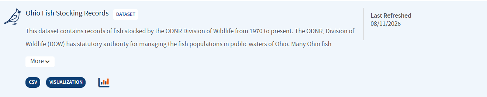
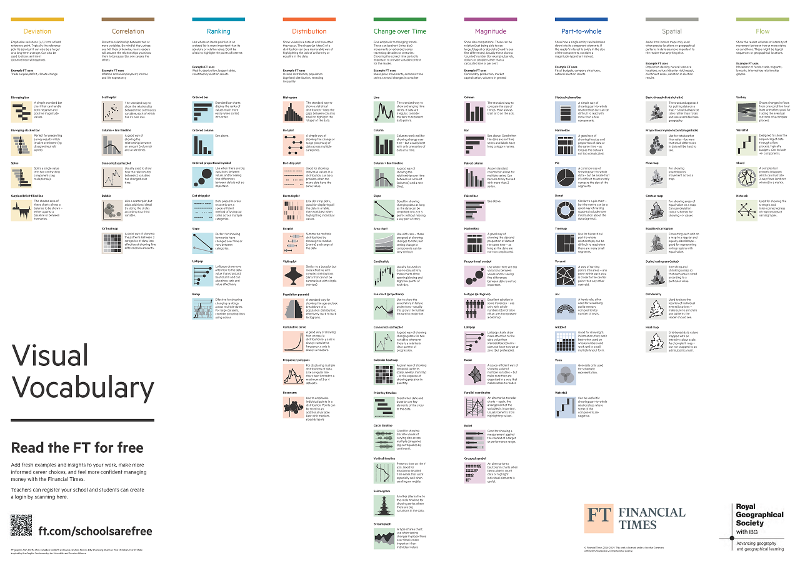
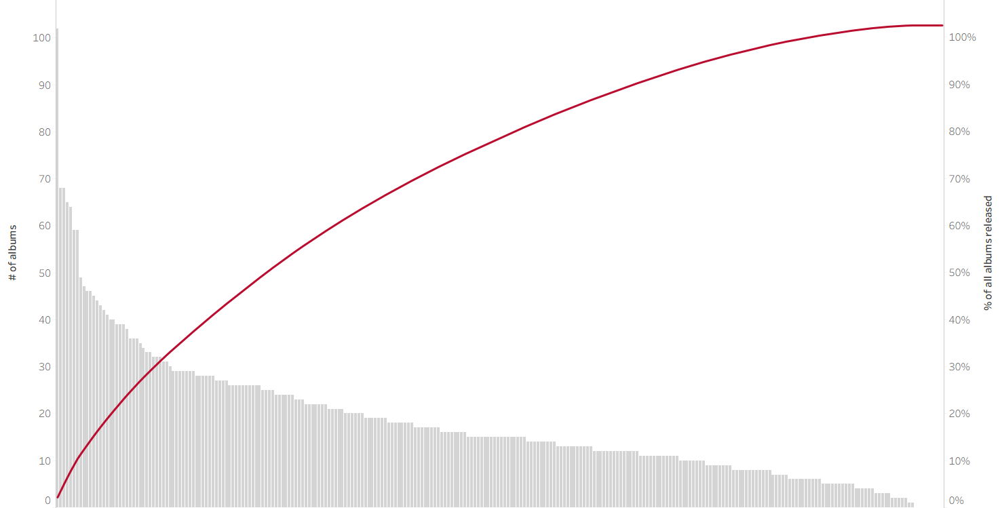

---
format:
  revealjs:
    theme: white
    css: 
      - slides.css
      - ../styles/custom.scss
      - https://cdn.jsdelivr.net/npm/bootswatch@5/dist/simplex/bootstrap.min.css

    include-in-header:
      - ../styles/osu-fonts.html
    logo: ../images/osu_libraries.png
    slide-number: true
    chalkboard: true
    multiplex: true
bibliography: ../references.bib

---

## Tableau for Research - Day 2

{width="100%" fig-align="center" fig-alt="A computer with a screen showing a survey"}

---

## Practice Matters

### Inspiration and examples
- [Tableau Public Viz of the Day](https://public.tableau.com/app/discover/viz-of-the-day)
- [Flowing Data](https://flowingdata.com/category/visualization/)

### Explore data journalism
- [CNN](https://www.cnn.com/)
- [The New York Times](https://www.nytimes.com/)
- [The Washington Post](https://www.washingtonpost.com/)

---

## DRAMA Framework

The DRAMA Framework, first introduced on Day 1, is also useful for critically evaluating data visualizations. [@primeau]
<div class="list-group">
<div class="d-flex w-100 justify-content-between"><p class="mb-1"><strong>D</strong>ate</p></div><small>Is the data current and up to date? Does it reflect current trends?</small>
<div class="d-flex w-100 justify-content-between"><p class="mb-1"><strong>R</strong>elevance</p></div><small>Is the dataset appropriate for your research question, population, and intended use?</small>
<div class="d-flex w-100 justify-content-between"><p class="mb-1"><strong>A</strong>ccuracy</p></div><small>Is the data reliable, valid and consistently collected?</small>
<div class="d-flex w-100 justify-content-between"><p class="mb-1"><strong>M</strong>otivation</p></div><small>Why was the data collected, and are there any potential biases or important omissions?</small>
<div class="d-flex w-100 justify-content-between"><p class="mb-1"><strong>A</strong>uthority</p></div><small>Who collected the data and are they credible?</small>
</div>

---

## Groups and Hierarchies

### Why group data in Tableau?

- **Normalize values – **Combine similar entries to ensure consistency (e.g., merging "OH" and "Ohio").
- **Correct errors – **Fix inconsistencies or typs in category names.
- **Simplify categories – **Consolidate detailed values into braoder, more meaningful groups.

---

<div class="card border-primary mb-3 p-1" style="max-width: 100%;">
  <div class="card-header" style="font-size: 2.4rem;"><strong>Multiple ways to accomplish a task!!!</strong></div>
  <div class="card-body"><p><small>Groups are another great example where there is more than one way to accomplish the same task!!!</small></p>
  </div>
</div>

---

<div class="alert alert-dismissible alert-primary">
  Exercise 7: Group data
</div>

<div>
<small>
<p>Create a text table showing the <strong>peak US chart positions</strong> for albums by five of your favorite artists.</p>
<table>
<tbody>
    <tr>
        <td>1.</td>
        <td>Start a new worksheet and rename it:</td>
        <td><ul><li><strong>FavoriteArtistAlbum</strong>.</li></ul></td>
    </tr>
    <tr>
        <td>2.</td>
        <td>Select the relevant fields</td>
        <td><ul><li>Drag <strong>Artist</strong> to the <strong>Rows shelf</strong>.</li><li>Place <strong>Peak US</strong> on the <strong>Columns shelf</strong>.</li></ul></td>
    </tr>
    <tr>
        <td>3.</td>
        <td>Open Show Me and select Text Tables</td>
        <td></td>
    </tr>
    <tr>
        <td>4.</td>
        <td>Select your top 5 favorite artists.</td>
        <td><ul><li>Click on your first favorite artist.</li><li>Hold <strong> Ctrl + Click</strong> to select the others.</li></ul></td>
    </tr>
    <tr>
        <td>5.</td>
        <td>Click the paperclip icon 📎 on the tooltip for the last artist selected.</td>
        <td></td>
    </tr>
</tbody>
</table>
</small>
</div>

---

<div>
<small>
<table>
<tbody>
    <tr>
        <td>6.</td>
        <td>Edit group alias.</td>
        <td><ul><li>Right-click the first artist.</li><li>Select <strong> Edit Alias</strong>.</li><li>Rename to <strong>Favorite artists.</strong></li></ul></td>
    </tr>
    <tr>
        <td>7.</td>
        <td>Right-click Favorite artists and choose:</td>
        <td><ul><li>✔ Keep only.</li></ul></td>
    </tr>
    <tr>
        <td>8.</td>
        <td>Adjust fields.</td>
        <td><ul><li>Drag <strong>Artist</strong> to the <strong>Rows shelf</strong>.</li><li>Drag <strong>album_title</strong> to the <strong>Rows shelf</strong>.</li><li>Remove <strong>Favorite artists</strong> from the <strong>Rows shelf</strong>.</li></ul></td>
    </tr>
    <tr>
        <td>9.</td>
        <td>Rename group.</td>
        <td><ul><li>Right-click <strong>Artist (group) 1 </strong> in the <strong>Data Pane</strong>.</li><li>Select <strong>Rename</strong> and type <strong>Favorite artists</strong>.</li></ul></td>
    </tr>
</tbody>
</table>
</small>
</div>

---

<div class="alert alert-dismissible alert-primary">
  Exercise 8: Group data
</div>

<div>
<small>
<p>On the <strong>FavoriteArtistAlbum</strong> sheet, use the <strong>Data Pane</strong> to group 10 of your <strong>Favorite albums</strong> into a single group.</p>
<table class="table">
<tbody>
    <tr>
        <td>1.</td>
        <td>Right-click <strong>album_title</strong> and select:</td>
        <td><ul><li><strong>Create > Group</strong>.</li></ul></td>
    </tr>
    <tr>
        <td>2.</td>
        <td>Rename the group:</td>
        <td><ul><li><strong>Favorite albums</strong>.</li></ul></td>
    </tr>
    <tr>
        <td>3.</td>
        <td>Find and add albums to the group.</td>
        <td>
            <ul>
                <li>Click <strong>Find >></strong> to search for the first album title.</li>
                <li>Under <strong>Find members</strong>, type the name of your first favorite album title and click <strong>Find All</strong>.</li>
                <li>When the album appears in the list, select it and click <strong>Group</strong>.</li>
                <li>Alias the group <strong>Favorite albums</strong>.</li>
            </ul></td>
    </tr>
</tbody>
</table>
</small>
</div>

---

<div>
<small>
<table class="table">
<tbody>
    <tr>
        <td>4.</td>
        <td>Repeat the process for each additional album.</td>
        <td>
            <ul>
                <li>Type the album name under <strong>Find members</strong>, then click <strong>Find All</strong>.</li>
                <li>Select the album.</li>
                <li>Use the <strong>Add to:</strong> dropdown to add each adidtional album to <strong>Favorite albums</strong>.</li>
            </ul>
        </td>
    </tr>
    <tr>
        <td>5.</td>
        <td>✔ Include 'Other' to consolidate non-favorite titles.</td>
        <td></td>
    </tr>
</tbody>
</table>
</small>
</div>

---

## Creating Custom Hierarchies

Custom hierarchies save space and add interactivity by allowing users to drill down to more detailed levels of data. 

### Date Hierarchies

When a date field is added to the view, Tableau automatically creates a hierachy —**YEAR**, **QUARTER**, **MONTH**, and **DAY**. You can expand this hierachy using the  `+` symbol.

### Custom Hierarchies

You can create your own hierarchies by stacking one dimension or one measure onto another in the **Data Pane**.

---

## Applying Formatting in Tableau

### Format the entire workbook:

- Go to the **Format** menu and select **Workbook**. This allows you to apply consistent styles across all sheets.

### Format an individual worksheet:

- Use the **Format** pane by selecting **Font, Alignment, Shading, Borders,** or **Lines** from the Format toolbar.
- Alternatively, right-click on a **pill** and choose **Format**.

---

<div class="alert alert-dismissible alert-primary">
  Exercise 9: Format BarChart1
</div>

<div>
<small>
<p>To prepare <strong>BarChart1</strong> as a clear, engaging figure for an academic paper, follow these steps:</p>
<table>
<tbody>
    <tr>
        <td>1.</td>
        <td>Ensure full visibility of <strong>Artist</strong> names on the X-axis<br><ul>
            <li>Hover over the X-axis line until the ↕ <strong>(up-down arrow)</strong> appears.</li>
            <li>Click and drag the line upward to increase the height of the axis area.</li>
            <li>Hover over the right edge of the Artist name <strong>Bad Company</strong> until the ↔︎ <strong>(left-right arrow)</strong> appears. </li>
            <li>Click and drag to the right to expand the column header, ensuring the full name is visible.</li>
        </ul></td>
    </tr>
    <tr>
        <td>2.</td>
        <td>Adjust bar width<br><ul><li>On the <strong>Marks Card</strong> click <strong>Size</strong></li><li>Drag the slider to the left to decrease the width of the horizontal bars.</li></ul></td>
    </tr>
</tbody>
</table>
</small>
</div>

---

<div>
<small>
<table>
<tbody>
    <tr>
        <td>3.</td>
        <td>Remove rudundant field label<br><ul><li>Since the artist names are already shown in the column headers, the field label is unecessary.</li><li>Right-click <strong>Artist</strong> in view and select <strong>Hide Field Labels for Columns</strong></li></ul></td>
    </tr>
    <tr>
        <td>4.</td>
        <td>Remove unnecessary lines<br><ul><li>From the <strong>Format</strong> toolbar, select <strong>Lines</strong>.</li><li>In the <strong>Formatting Pane</strong>, go to the <strong>Rows</strong> tab and set <strong>Grid Lines</strong> to <strong>None</strong>.</li><li>Switch to the <strong>Sheet</strong> tab and set <strong>Axis Rulers</strong> and <strong>Zero Lines</strong> to <strong>None</strong>.</li></ul></td>
    </tr>
    <tr>
        <td>5.</td>
        <td>Customize Y-Axis Label and Tick Marks<br><ul><li>Right-click on <strong>Y-Axis</strong> and select <strong>Edit Axis</strong>.</li><li>Rename the axis title to <strong>Peak US Chart Position (Average)</strong>.</li><li>Click the <strong>Tick Marks</strong> tab, set <strong>Major Tick Marks</strong> to <strong>Fixed</strong> and define the interval as <strong>15</strong>.</li><li>Close the dialog.</li></ul></td>
    </tr>
</tbody>
</table>
</small>
</div>

---

<div>
<small>
<table>
<tbody>
    <tr>
        <td>6.</td>
        <td>Experiment with removing Y-Axis<br><ul><li>Copy <strong>AVG(Peak US)</strong> to <strong>Label</strong> on <strong>Marks Card</strong>.</li><li>Click <strong>Format</strong> on the <strong>AVG(Peak US)</strong> pill to open the <strong>Formatting Pane</strong>.</li><li>Under the <strong>Pane</strong> tab, set <strong>Numbers</strong> to <strong>Number (Custom)</strong> and reduce decimal places to <strong>0</strong>.</li><li>Right-click the Y-axis and uncheck <strong>Show Header</strong> to hide it.</li><li>To restore: click the <strong>▼ caret</strong> on the <strong>AVG(Peak US)</strong> pill and select <strong>Show Header</strong>.</li></ul></td>
    </tr>
    <tr>
        <td>7.</td>
        <td>Adjust font for clarity<br><ul><li>In the <strong>Formatting Pane</strong>, select <strong>Font</strong>.</li><li>From the <strong>Fields ▼</strong> dropdown, choose <strong>AVG(Peak US)</strong> and …</li><ul><li>Increase the font size from <strong>9pt</strong> to <strong>12pt</strong>.</li><li>Match font color to the bar color and apply <strong>Bold</strong></li><li>Then select <strong>Artist</strong> from the same dropdown and set the default font color to match the bar color.</li></ul></ul></td>
    </tr>
</tbody>
</table>
</small>
</div>

---

<div>
<small>
<table>
<tbody>
    <tr>
        <td>8.</td>
        <td>Add a descriptive title<br><ul><li>Double click the worksheet title <strong>Barchart1</strong>.</li><li>On the first line enter: <em>Average Peak US Chart Position</em></li><li>On the second line enter: <em>2025 Rock n Roll Hall of Fame Inductees</em></li><li>Adjust font sizes and styling as needed</li></ul></td>
    </tr>
</tbody>
</table>
</small>
</div>

---

<div>
<small>
<table>
<tbody>
    <tr>
        <td>9.</td>
        <td>Add a Zero Line<br><ul><li>From the <strong>Format</strong> toolbar, select <strong>Lines</strong>.</li><li>On the <strong>Rows</strong> tab, set a <strong>solid, thick, dark gray</strong> zero line.</li></ul></td>
    </tr>
    <tr>
        <td>10.</td>
        <td>Export the visualization for publication<br><ul><li>Go to the <strong>Worksheet</strong> toolbar and select <strong>Export > Image</strong>.</li><li>Uncheck all options <strong>except Title</strong> and <strong>View</strong>.</li><li>Save the image as <strong>Scalable Vector Graphics (*.svg)</strong> for high-quality print use.</li></ul></td>
    </tr>
</tbody>
</table>
</small>
</div>

---

## Table Calculations

Table caculations enhance Tableau's performance and efficiency by limiting the scope of computation to what's displayed in the view, rather than the entire dataset.

---

## Common Table Calculations{.scrollable}

- Running Total
- Difference
- Percent Difference
- Percent of Total
- Rank
- Percentile
- Moving Average
- Year-to-Date (YTD) Total
- Compound Growth Rate
- Year-over-Year (YoY) Growth
- YTD Growth

---

## Data Ohio

{fig-alt="Screenshot of data.ohio.gov"}

---

## Ohio Fish Stocking Records{.smaller}

{fig-alt="Screenshot of first 2 sentences of description for Ohio Fish Stocking Records dataset. The description states This dataset contains records of fish stocked by the ODNR Division of Wildlife from 1970 to present. The ODNR, Division of Wildlife (DOW) has statutory authority for managing the fish populations in public waters of Ohio."}

Ohio considers data a shared strategic asset. The resource is designed to help anglers:

- Identify fishing locations where specific species have been stocked.
- Explore detailed stocking histories for waters they frequently fish or are particularly interested in.

---

<div class="alert alert-dismissible alert-primary">
  Table calculations
</div>

<div><p>Let's walk through a few table calculation examples using the <code>ODNR_fish_stocking.csv</code> dataset.
</p>
</div>

---

## Choose an effective visual

{width="100%" fig-alt="A detailed infographic chart titled Visual Vocabulary categorizes various data visualization types into ten groups: Deviation, Correlation, Ranking, Distribution, Change over Time, Magnitude, Part-to-whole, Spatial, and Flow. Each category includes labeled examples with small colored thumbnails and brief descriptions, highlighting key visual elements and use cases, with a clean layout using distinct background colors for each section to aid differentiation."}

[https://ft-interactive.github.io/visual-vocabulary/](https://ft-interactive.github.io/visual-vocabulary/)

---

## Part-to-whole Relationships{.smaller}

<div class="alert alert-dismissible alert-primary">
  Pie chart
</div>

<div><p>Data visualization experts often discourage using pie charts because humans struggle to accurately compare angles and areas.</p>
<p>There are situations, however, where a pie chart may be appropriate—such as when the audience expects it or when it provides a clear and immediate visual impact.</p>
<p>Let’s return to our <code>rock_n_roll_performers.csv</code> dataset to explore the pie chart.</p>
</div>

---

<div class="alert alert-dismissible alert-primary">
  Exercise 10: Donut Chart
</div>

<div>
<small>
<p>Create <strong>Donut Chart</strong> showing the number of albums released by <strong>2025 Rock N Roll Hall of Fame inductees</strong>.</p>
<table class="table">
<tbody>
    <tr>
        <td>1.</td>
        <td>Duplicate the existing sheet<br><ul><li>Right-click on <strong>PieChart</strong> and select <strong>Duplicate</strong>.</li><li>Rename the new sheet <strong>DonutChart</strong>.</li></ul></td>
    </tr>
    <tr>
        <td>2.</td>
        <td>Create a calculated field<br><ul><li>Double click on the <strong>Rows</strong> shelf and type <strong>avg(0)</strong>.</li><li>It doesn’t really matter whether you use average, minimum, or maximum. Tableau requires aggregated measures, and the average of zero is always zero.</li></ul></td>
    </tr>
    <tr>
        <td>3.</td>
        <td>Duplicate this calculation<br><ul><li>Hold <strong>Ctrl</strong> (or <strong>Option</strong> on Mac) and drag <strong>AGG(avg(0))</strong> to the right to duplicate the pill on the <strong>Rows</strong> shelf.</li><li>Notice there are now 2 pie charts and a separate marks card for each chart.</li></ul></td>
    </tr>
</tbody>
</table>
</small>
</div>

---

<div>
<small>
<table class="table">
<tbody>
    <tr>
        <td>4.</td>
        <td>Format Marks Card<br><ul><li>On the Marks Card labeled <strong>AGG(avg(0)) (2)</strong>:<ul><li>Click the dropdown next to Automatic and select Circle.</li><li>Remove <strong>Artist, CNT(rock_n_roll_studio_albums.csv)</strong> from color, size, and label.</li><li>Click on <strong>Color</strong>:<ul><li>Change color to <strong>White</strong>.</li><li>Add a <strong>dark gray border</strong>.</li></ul></li></ul></li></ul></td>
    </tr>
    <tr>
        <td>5.</td>
        <td>Create a Dual Axis<br><ul><li>On the <strong>second AGG(avg(0)) pill</strong>, click the ▼ caret and select <strong>Dual Axis</strong>.</li></ul></td>
    </tr>
    <tr>
        <td>6.</td>
        <td>Adjust size<br><ul><li>On the <strong>Marks Card</strong> labeled <strong>AGG(avg(0))</strong>:<ul><li>Click <strong>Size</strong></li><li>Drag the slider to the right to increase the size of the colored pie chart.</li></ul></li><li>On the Marks Card labeled <strong>AGG(avg(0)) (2)</strong>:<ul><li>Drag the slider to the right to increase the size of the white circle.</li></ul></li></ul></td>
    </tr>
</tbody>
</table>
</small>
</div>

---

<div>
<small>
<table class="table">
<tbody>
    <tr>
        <td>7.</td>
        <td>Adjust formatting<br><ul><li><strong>Remove unnecessary lines</strong>:<ul><li>From the <strong>Format</strong> toolbar, select <strong>Lines</strong>.</li><li>On the <strong>Rows</strong> tab:<ul><li>Set <strong>Zero Lines</strong> to <strong>None</strong>.</li></ul></li></ul></li><li><strong>Remove borders</strong>:<ul><li>From the <strong>Formatting Pane</strong>, select <strong>Borders</strong>.</li><li>On the <strong>Sheet</strong> tab, set:<ul><li><strong>Row Divider</strong> to <strong>None</strong> on <strong>Pane</strong>.</li><li><strong>Column Divider</strong> to <strong>None</strong> on <strong>Pane</strong>.</li></ul></li></ul></li><li><strong>Remove headers</strong><ul><li>Right-click the <strong>left avg(0)</strong> axis and uncheck <strong>Show Header</strong>.</li></ul></li></ul></td>
    </tr>
</tbody>
</table>
</small>
</div>

---

<div class="alert alert-dismissible alert-primary">
  Exercise 11: Tree Map
</div>

<div>
<small>
<p>Quickly convert the <strong>Donut Chart</strong> created in Exercise 10 to a <strong>Tree Map</strong></p>
<table class="table">
<tbody>
    <tr>
        <td>1.</td>
        <td>Duplicate the existing sheet<br><ul><li>Right-click on <strong>DonutChart</strong> and select Duplicate</li><li>Rename the new sheet <strong>TreeMap</strong></li></ul></td>
    </tr>
    <tr>
        <td>2.</td>
        <td>Open <strong>Show Me</strong> and select <strong>Treemaps</strong></td>
    </tr>
    <tr>
        <td>3.</td>
        <td>On the Marks Card<br><ul><li>Copy <strong>Artist</strong> to <strong>Color</strong>.</li><li>Copy <strong>CNT(rock_n_roll_studio_albums.csv)</strong> to <strong>Label</strong></li></ul></td>
    </tr>
    <tr>
        <td>4.</td>
        <td>Add a Percent of Total Table Calculation<br><ul><li>Click the ▼ caret on the <strong>CNT(rock_n_roll_studio_albums.csv)</strong> pill assigned to <strong>Label</strong></li><li>Hover over <strong>Quick Table Calculation</strong> ► and select <strong>Percent of Total</strong></li></ul></td>
    </tr>
</tbody>
</table>
</small>
</div>

---

<div>
<small>
<table class="table">
<tbody>
    <tr>
        <td>5.</td>
        <td>Update title<br><ul><li>Double click the worksheet title</li><li>Enter:<ul><li><em>Percentage of total albums released by 2025 inductees</em></li></ul></li></ul></td>
    </tr>
</tbody>
</table>
</small>
</div>

---

## Dual-axis Combination Chart{.smaller}

<div class="alert alert-dismissible alert-primary">
  Dual-axis chart
</div>

A dual-axis combination chart lets you display two different data fields on the same graph, either to save space or to highlight comparisons more effectively. You can also enhance your visual analysis by layering multiple mark types (like bars and lines) in a single view.

Let’s dive back into our `rock_n_roll_performers` dataset to create a dual-axis chart that highlights our favorite albums and their peak U.S. chart positions. 

---

## Pareto Chart{.smaller}

Pareto charts illustrate the **Pareto Principle**, which suggests that roughly **80% of outcomes result from 20% of causes**. In Tableau, these charts are built using **table calculations**. Individual values are displayed as bars in **descending order**, while a **cumulative percentage line** overlays the bars to show the proportion each category contributes to the total.

{fig-align="center" fig-alt="Bar chart combined with a red cumulative percentage line illustrating distribution of a dataset. Gray bars represent the number of albums released by each artist decreasing from left to right, while the red line shows cumulative total reaching 100%, highlighting concentration of data in first bars."}

---

<div class="alert alert-dismissible alert-primary">
  Pareto chart
</div>

Create a Pareto Chart showing the cumulative percentage of album titles of all inductees into the [Rock N Roll Hall of Fame](https://en.wikipedia.org/wiki/List_of_Rock_and_Roll_Hall_of_Fame_inductees)

---

## Calculated fields

Calculated fields empower you to transform your data directly within Tableau. You can use calculated fields to:

- Clean and organize data,
- Define custom segments,
- Add interactivity, or
- Perform statistical and mathematical calculations.

---

## Calculated fields

<div class="alert alert-dismissible alert-primary">
  Calculated fields
</div>

Let’s take a closer look at how **calculated fields** work by analyzing **RIAA certifications** for our favorite albums.

Over time, the [Recording Industry Association of America (RIAA)](https://en.wikipedia.org/wiki/Recording_Industry_Association_of_America) has updated its certification standards to reflect changes in how music is consumed. Originally based solely on album sales, certifications now account for digital downloads and streaming activity.

---

## RIAA Certification Levels{.smaller}

To keep things simple, we’ll use the current criteria for album-level awards, as defined by the RIAA in **February 2016** to categorize albums by their certification level based on total units.

🎵 **RIAA Certification Levels**

- Gold: 500,000 units
- Platinum: 1,000,000 units
- Multi-Platinum: 2,000,000+ units (in 1,000,000-unit increments)
- Diamond: 10,000,000 units
  
💽 **What Counts as a Unit?**
A single unit can be any of the following:

- One full digital or physical album sale
- 10 track downloads from the same album
- 1,500 on-demand audio or video streams from the album

---

## Example

```{.python}
if [Certification Riaa Status]='Gold' then 500000
elseif [Certification Riaa Status]='Platinum' then 1000000
elseif [Certification Riaa Status]='Multiplatinum' then 2000000
elseif [Certification Riaa Status]='Diamond' then 10000000
end
```

---

## Parameters

In Tableau, parameters:

- **Replace constant values** such as numbers, dates, or text strings in calculations, filters, or reference lines, making your dashboards more flexible and dynamic.
- **Enhance interactivity** by allowing users to control what data is displayed or how it's calculated, depending on how the parameter is integrated into the view.

---

## Parameters

<div class="alert alert-dismissible alert-primary">
  Parameters
</div>

Let’s take our **CalculatedFields** text table and **transform it into a bar chart**. Then we will create a parameter to highlight specific albums.

---

## Example

```{.python}
[Certification Riaa Status]=[Highlight album]

# This expression returns True for albums that match the selected certification in the parameter. 
```

---

<div class="card border-primary mb-3 p-1" style="max-width: 100%;">
  <div class="card-header" style="font-size: 2.4rem;">Tip - Parameters</div>
  <div class="card-body"><small><p>There are countless creative ways to use <strong>parameters</strong> with <strong>calculated fields</strong> in Tableau. You can:</p><ul><li>Highlight or filter specific data</li><li>Add weights or thresholds</li><li>Dynamically control reference lines</li><li>Switch between metrics or dimensions</li><li>And much more!</li></ul> </small> 
  </div>
</div>

---

## Basic Mapping

<div class="alert alert-dismissible alert-primary">
  Basic mapping
</div>

The `ODNR_fish_stocking.csv` dataset includes **latitude and longitude** for each stocking location. Let's turn this data into a meaningful map.

---

## Dashboards

Creating effective dashboards is both an art and a science and is a skill that develops with time, experience, and thoughtful practice. Great dashboards are tailored to a specific audience, provide clear context and guidance, encourage interaction, and follow visual best practices.

---

### Considerations{.smaller}

Before designing a dashbaord, pause and consider your audience. A highly detailed, data-dense dashboard might be perfect for one group but overwhelming for another. Others may need narrative context embedded in each view. Ask yourself:

- What is the primary goal of this dashboard?
- How will it be used?
- What questions should it help answer?
- How will it support decision-making?

---

<div class="alert alert-dismissible alert-primary">
  Dashboards
</div>

Let's build a dashboard that compares the highest **Peak US chart position** of albums released by each 2025 __[Rock and Roll Hall of Fame]()__ inductee with all albums released by **your favorite artist**. This dashboard will include three key views:

- Barchart1
- FavoriteArtistAlbum
- Scatterplot1

---

## References

::: {#refs}
:::